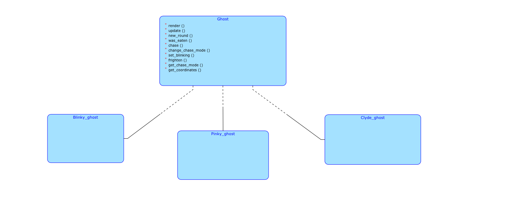

# Pac-Man 

I am going to try to pay tribute to the great japanese game designer named Toru Iwatani, who created one of the most
popular arcade games in the computer world - Pac-Man.

### SPECIFICATION

The player controls Pac-Man through a blue maze, eating white dots, which are called pellets. When all dots are eaten, 
Pac-Man is given points and goes to the next level. Three enemies, which look like colorful ghosts ("Blinky" - red one, "Pinky" - not difficult to guess the color and "Clyde" - orange one).
They try to catch Pac-Man, each in their own way (different algorithms of chasing). If an enemy touches Pac-Man, a life is lost and the Pac-Man dies. 
When all lives have been lost (the player has 3 lives in total), the game ends.
Near the corners of the maze are four larger, flashing dots known as power pellets that provide Pac-Man with the temporary ability to eat the enemies. 
The enemies turn deep blue, reverse  and move more slowly allowing Pac-Man to eat them. When an enemy is eaten, the player is rewarded with 200 points. 
Blue enemies flash white to signal that they are about to become dangerous again.
The player can select the difficulty level, which affects on speed of ghosts, intelligence of AI. In the beginning, there is an opportunity for player to download own
map ( .txt file with 2d array with 56 columns and 59 rows, where 1 is indicated as wall, 2 - dot (pellet), 3 - portal, 4 - power dots, which allows Pacman to eat ghosts.)
At the end of the file you need to have level of difficulty (from 0 to 2), coordinates (x, y) of pacman and three ghosts (in the precise order - Blinky, Pinky, Clyde).

###  USAGE OF POLYMORPHISM

